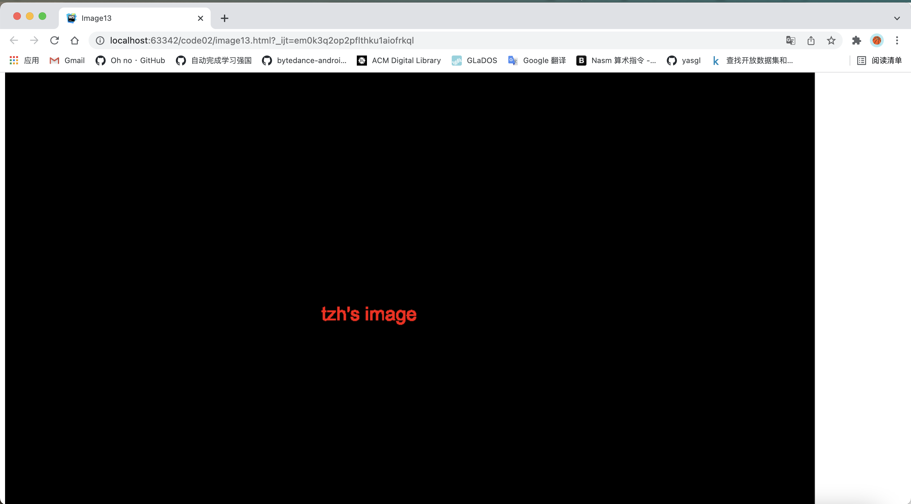

191250133 陶泽华

# 1.操作说明

本项目是基于第一次作业实现的。登录进入图片库页面后点击右下角最后一张图片就可以进入页面，看到实现的包括原图像、含有可见水印的图像、被添加的数字水印和添加了该数字水印的结果图。


点击右下角圈出来的图片就可以进入本次作业实现的页面。页面上顺序从上到下分别显示的是含有可见水印的图像（可见水印在图片的右下角 tzh's image）、原图像、被添加的数字水印和添加了该数字水印的结果图

对应的html存放在代码目录下的image13.html中，可以通过上述方法点击进入，也可以直接打开image13.html查看。

# 2. 方法和关键代码说明

## 2.1 可见水印

采用了**背景图（canvas）**的方式来实现可见水印。具体步骤如下：（实现的水印在图片的右下角）

1. 首先使用canvas 绘制一个水印，以下代码存放在createWaterMark函数下，该函数返回`canvas.toDataURL();`

   ```javascript
   var img = new Image();
   img.src='images/13.jpg';
   const canvas = document.createElement('canvas');
   // 获得图片的长和宽
   canvas.width = img.width;
   canvas.height = img.height;
   // 指定在画布上绘制的类型
   const ctx = canvas.getContext('2d');
   // 字体颜色
   ctx.fillStyle = '#fff';
   // 透明度
   ctx.globalAlpha = 1;
   ctx.font = `50px Arial`;
   // 将水印显示在画布的右下角
   ctx.fillText('tzh\'s image',1000,650);
   ```

2. 通过`canvas.toDataURL()` 来拿到文件流的 url ，并将获取的 url 填充在元素的背景中

   ```javascript
   const temp = document.createElement('div');
   // 与css进行绑定
   temp.className = 'watermark';
   // 将获取的 url 填充元素的背景
   temp.style.backgroundImage = `url(${createWaterMark()})`;
   document.body.appendChild(temp);
   ```

3. 设置背景图片的属性

   ```css
   .watermark {
       position: absolute;
       top: 0px;
       right: 0px;
       bottom: 0px;
       left: 0px;
       pointer-events: none;
       background-repeat: no-repeat;
   }
   ```
   
3. 效果如下：

   

## 2.2 不可见水印

通过**修改RGB分量**来实现不可见水印

1. 使用canvas绘制想要使用的不可见水印

   ```javascript
   var ctx=createInvisibleWaterMark('canvas1');
   ```

   调用了createInvisibleWaterMark函数，函数实现如下：

   ```javascript
   var createInvisibleWaterMark = function (id) {
       var ctx = document.getElementById(id).getContext('2d');
       ctx.font = '30px Arial';
       ctx.fillText('tzh\'s image', 500, 400);
       return ctx;
   };
   ```

   图片形式如下：

   

2. 通过 getImageData() 复制画布上指定矩形的像素数据，这里datatoProcess获得画布画出的文本信息，方便后续添加到图片上。

   ```javascript
   var datatoProcess = ctx.getImageData(0, 0, ctx.canvas.width, ctx.canvas.height).data;
   ```

3. 进行编码，为指定的图片加上不可见水印。

   ```javascript
   var img = new Image();
   img.src = src;
   img.onload = function () {
       // 获取指定区域的canvas像素信息
       ctx.drawImage(img, 0, 0);
       // 获得原始图片的信息
       var originalData = ctx.getImageData(0, 0, ctx.canvas.width, ctx.canvas.height);
       enData(ctx, datatoProcess, originalData)
   };
   ```

4. 编码函数实现如下，若`newData[i + 3] !== 0`则代表该区域存在文字信息（对应的是由画布画出的需要添加的不可见水印）

   ```javascript
   // 在待加密的图像上处理图像信息
       var enData = function (ctx, newData, originalData) {
           var data = originalData.data;
           // 4个为一组，RGBA（A代表透明度）
           for (var i = 0; i < data.length; i += 4) {
               if (newData[i + 3] !== 0 && data[i] % 2 === 0) {
                   // 有文字信息
                   data[i]++;
               } else if (newData[i + 3] === 0) {
                   // 没有文字信息
                   data[i] = 0;
               }
   
           }
           console.log(originalData.data);
           // 通过 putImageData() 将图像数据放回画布
           ctx.putImageData(originalData, 0, 0);
       };
   ```

5. 解码函数如下：

   ```javascript
   var deData = function (ctx, originalData) {
       var data = originalData.data;
       for (var i = 0; i < data.length; i += 4) {
           if (data[i] % 2 !== 0) {
               data[i] = 255;
           } else {
               data[i] === 0;
           }
           data[i + 1] = 0;
           data[i + 2] = 0;
       }
       console.log(originalData.data);
       // 将结果绘制到画布
       ctx.putImageData(originalData, 0, 0);
   };
   ```

   


