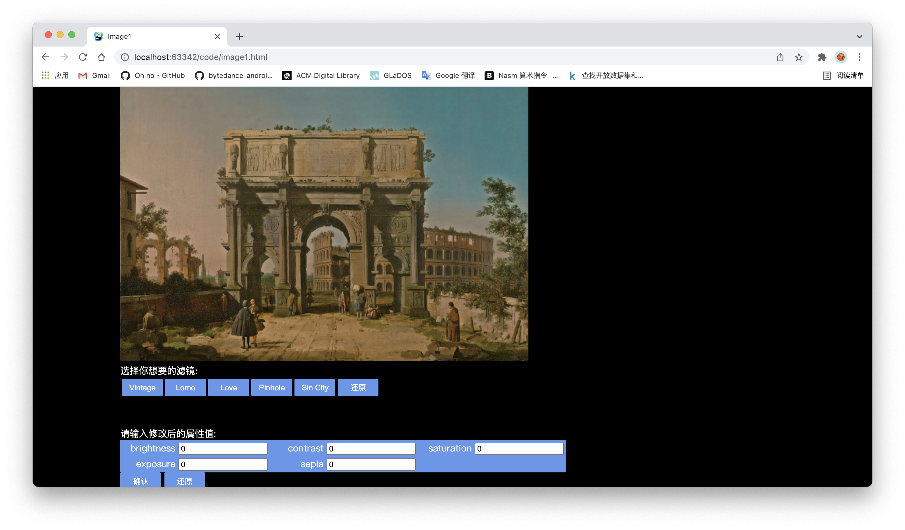
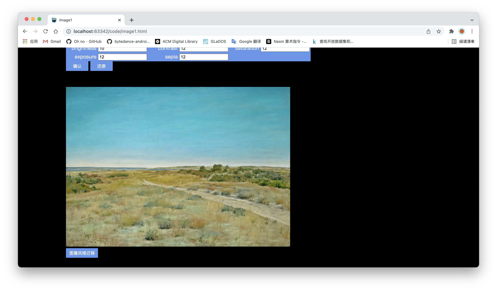
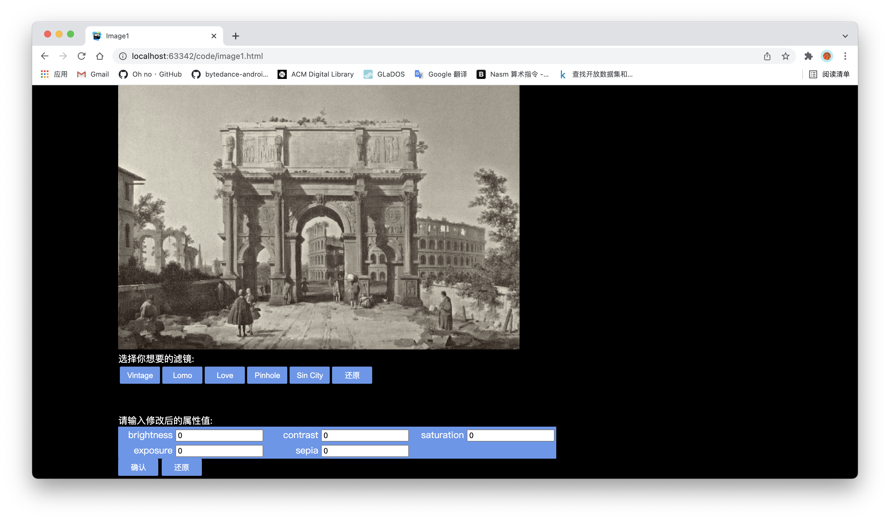
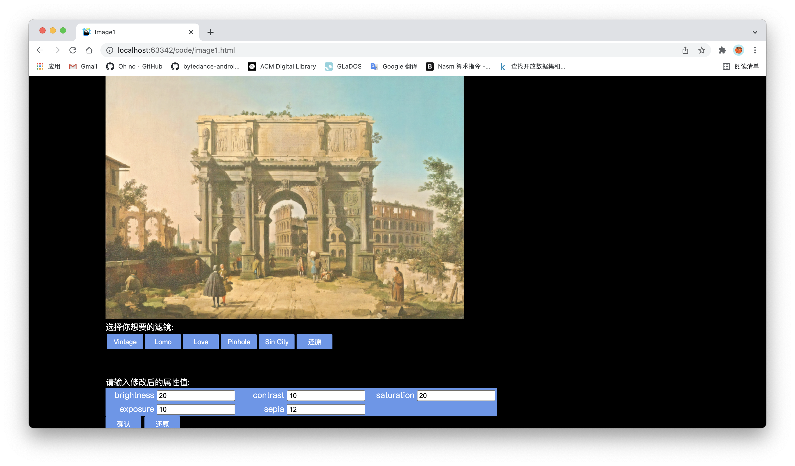
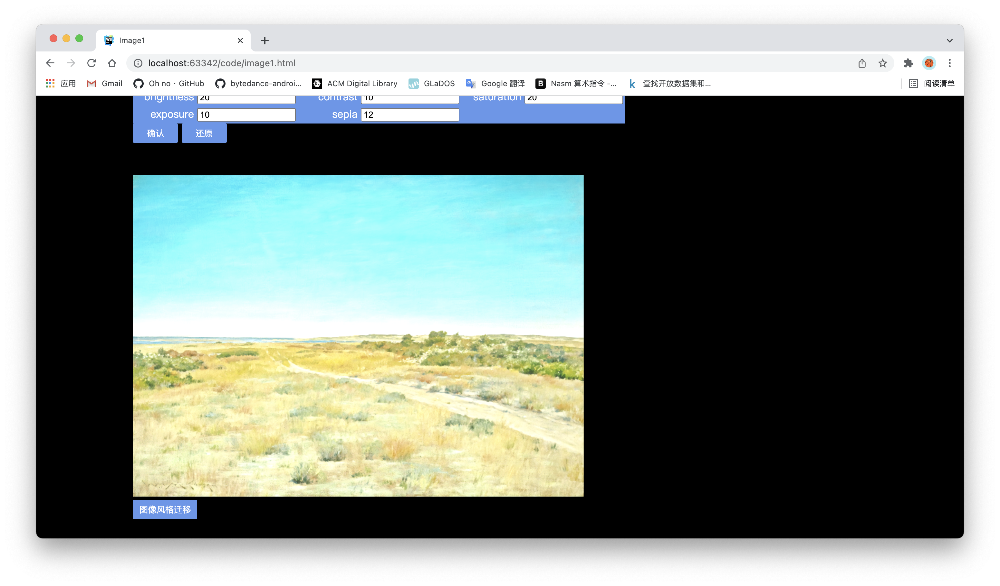
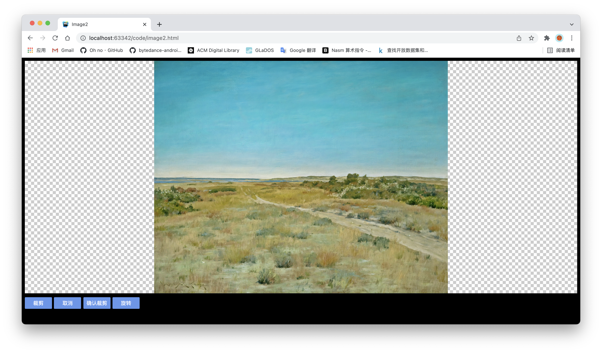
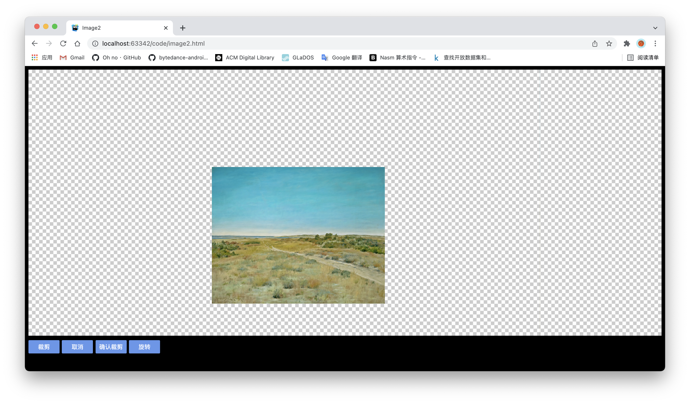
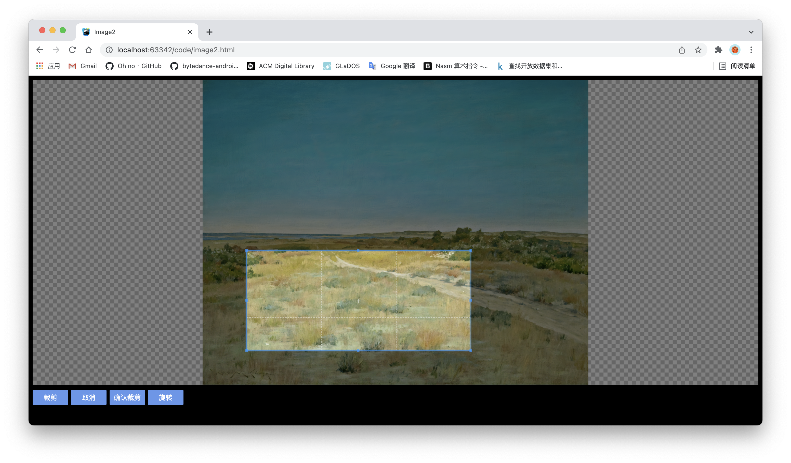
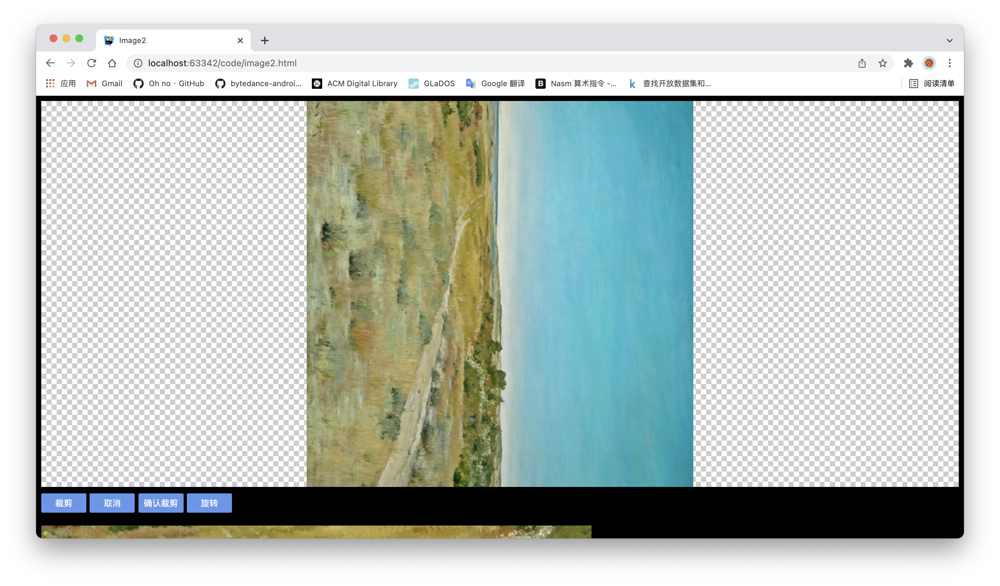

191250133 陶泽华

[TOC]

# 1.实现的功能

1. 滤镜功能，可以选择一组预设滤镜

2. 手动更改属性（例如亮度，对比度，饱和度）以获得所需的结果

3. 裁剪、旋转和缩放图像

4. 图像风格迁移

# 2. 操作说明

由于第一次作业没有使用js导致每一张图片对应一个html文件，这次作业选择了**在image1.html和image2.html的基础上对图像进行处理**，实现以上四个功能（**image1.html实现了滤镜功能、手动更改属性以获得效果以及图像风格迁移功能，image2.html实现了裁剪、旋转和缩放图像的功能**）。可以直接点击运行image1.html和image2.html文件查看实现的效果，也可以进入imageDir.html后点击如下两张圈出来的图片查看。（代码主要在image1.html和image2.html中）


1. 点击左上角第一张图片后将进入image1.html对应的页面（包括滤镜功能、手动更改属性以获得效果、图像风格迁移功能）：

   点击第一行对应的按钮可以选择想要的滤镜，这里选择Vintage滤镜后对应的效果如下：
   
   点击第一行最右边的**还原按钮**就可以恢复成原来的样子。也可以自己在下方输入自己想要的滤镜参数，对滤镜的效果进行更改。如这里输入brightness=20，contrast=10，saturation=20，exposure=10，speia=12，点击确认后，就会产生如下效果：

   
   这时候点击**图像风格迁移**，就会对一张新的图片产生一样的效果，效果如下：
   

2. 点击第一栏第二张图片就可以进入image2.html对应的页面（包括裁剪、旋转和缩放图像的功能）：
   
   **滚动鼠标**可以实现图片的放大和缩小：
   
   
   点击**裁剪按钮**或者直接按住屏幕并进行拖动就会进入裁剪模式，出现裁剪框。效果如下：
   
   点击**确认裁剪按钮**，就会在下方出现一张裁剪过后生成的图片：
   
   点击**旋转按钮**，可以旋转图片：
   

# 3. 方法和代码说明

## 3.1 image1.html

image1.html中使用caman.js实现了滤镜功能、手动更改属性以获得效果以及图像风格迁移功能

1. 下载caman完成后在html中的head标签下引入caman.js

   ```javascript
   <script type="text/javascript" src="node_modules/caman/dist/caman.full.js"></script>
   ```

2. **html部分**：

   1. 使用canvas来描绘图片，使用table显示5个滤镜对应的按钮

      ```
      <canvas id="image1" width="800px" height="500px"></canvas>
      <div style="color: white">选择你想要的滤镜:</div>
      <table>
          <tr>
              <td>
                  <button onclick="Vintage()">Vintage</button>
              </td>
              <td>
                  <button onclick="Lomo()">Lomo</button>
              </td>
              <td>
                  <button onclick="Love()">Love</button>
              </td>
              <td>
                  <button onclick="Pinhole()">Pinhole</button>
              </td>
              <td>
                  <button onclick="Sincity()">Sin City</button>
              </td>
              <td>
                  <button onclick="ret()">还原</button>
              </td>
          </tr>
      </table>
      ```

   2. 使用type="number"的input框帮助用户输入想要的滤镜参数，手动更改属性。使用`oninput="if(value>100)value=100;if(value<-100)value=-100"`来限制输入的value的大小。

      ```
      <div style="text-align: left; color: white">
          请输入修改后的属性值:
      </div>
      <table class="font">
          <tr>
              <td class="td1">
                  brightness
                  <input type="number" id="brightness" value="0"
                         oninput="if(value>100)value=100;if(value<-100)value=-100">
              </td>
              <td class="td1">
                  contrast
                  <input type="number" id="contrast" value="0"
                         oninput="if(value>100)value=100;if(value<-100)value=-100">
              </td>
              <td class="td1">
                  saturation
                  <input type="number" id="saturation" value="0"
                         oninput="if(value>100)value=100;if(value<-100)value=-100">
              </td>
          </tr>
          <tr>
              <td class="td1">
                  exposure
                  <input type="number" id="exposure" value="0"
                         oninput="if(value>100)value=100;if(value<-100)value=-100">
              </td>
              <td class="td1">
                  sepia
                  <input type="number" id="sepia" value="0"
                         oninput="if(value>100)value=100;if(value<0)value=0">
              </td>
          </tr>
      </table>
      <button onclick="change()">确认</button>
      <button onclick="ret()">还原</button>
      ```

   3. 使用canvas描绘一个新的图片，进行图像风格迁移

      ```
      <canvas id="image2" width="800px" height="500px"></canvas>
      <br>
      <button onclick="qian()" style="width:100px;">图像风格迁移</button>
      ```

3. **js部分**：

   1. 使用画布描绘图片，在页面载入的同时加载初始图片

      ```js
      var image = new Image();
      image.src = "./images/1.jpg";
      var c = document.getElementById("image1");
      var cxt = c.getContext("2d");
      cxt.fillStyle = "white";
      cxt.drawImage(image, 0, 0, 700, 500);
      
      
      image.onload = function () {
          cxt.drawImage(image, 0, 0, 700, 500);
      };
      ```

      ```javascript
      var image2 = new Image();
      image2.src = "./images/2.jpg";
      var c2 = document.getElementById("image2");
      var cxt2 = c2.getContext("2d");
      cxt2.fillStyle = "white";
      cxt2.drawImage(image2, 0, 0, 700, 500);
      
      image2.onload = function () {
          cxt2.drawImage(image2, 0, 0, 700, 500);
      };
      ```

   2. 实现5个预设定的滤镜的按钮上的方法，即使用camanjs为修改滤镜的参数，修改前使用`this.revert();`方法将之前修改的滤镜复原。这儿以Vintage滤镜为例子，其余的类似实现。

      ```javascript
      function Vintage() {
          Caman("#image1", image, function () {
            	this.revert();
              this.greyscale();
              this.contrast(5);
              this.noise(3);
              this.sepia(100);
              this.channels({red: 8, blue: 2, green: 4});
              this.gamma(0.87);
              this.render();
          });
      }
      ```
   
   3. 对于用户自定义滤镜的参数实现方法如下，使用`document.getElementById("brightness").value - "0"`来获得对应的输入框中用户输入的数值，并使用camanjs进行相应的设置。
   
      ```javascript
      function change() {
          Caman("#image1", image, function () {
            	this.revert();
              this.brightness(document.getElementById("brightness").value - "0");
              this.contrast(document.getElementById("contrast").value - "0");
              this.sepia(document.getElementById("sepia").value - "0");
              this.saturation(document.getElementById("saturation").value - "0");
              this.exposure(document.getElementById("exposure").value - "0");
              this.render();
          });
      }
      ```

   4. 还原方法ret的实现如下，只需要将画布重新描绘一下即可。
   
      ```javascript
      function ret() {
          cxt.drawImage(image, 0, 0, 700, 500);
      }
      ```

## 3.2 image2.html

image2.html使用cropper.js实现了裁剪、旋转和缩放图像的功能

1. 下载cropper.js完成后在html中的head标签下引入cropper.js

   ```html
   <link href="node_modules/cropperjs/dist/cropper.min.css" rel="stylesheet">
   <script src="node_modules/cropperjs/dist/cropper.min.js"></script>
   ```

2. **html部分**：

   1. 首先显示原图片

      ```
      <div class="i">
          
      </div>
      ```

   2. 定义一系列按钮方便进行操作

      ```
      <button onclick="crop()" style="color: #FFFFFF">裁剪</button>
      <button onclick="cancelCrop()" style="color: #FFFFFF">取消</button>
      <button onclick="decide()" style="color: #FFFFFF">确认裁剪</button>
      <button onclick="rotate()" style="color: #FFFFFF">旋转</button>
      ```

   3. 将裁剪后得到的图片进行展示

      ```
      <!-- 裁剪后的图片展示-->
      
      ```

3. **js部分**：

   1. 初始化cropper，使用`autoCrop: false`设置为不自动裁剪，方便用户自行操作

      ```javascript
      const cropper = new Cropper(image, {
          // 不自动裁剪
          autoCrop: false,
          crop(event) {
              console.log(event.detail.x);
              console.log(event.detail.y);
              console.log(event.detail.width);
              console.log(event.detail.height);
              console.log(event.detail.rotate);
              console.log(event.detail.scaleX);
              console.log(event.detail.scaleY);
          },
      });
      ```

   2. 用户点击裁剪按钮触发crop方法，可以进行手动裁剪。

      ```javascript
      // 设置手动裁剪
      function crop() {
          cropper.crop();
      }
      ```

   3. 用户点击取消裁剪按钮后会触发cancelCrop方法，取消裁剪。

      ```javascript
      // 取消裁剪
      function cancelCrop() {
          cropper.clear();
      }
      ```

   4. 用户确认裁剪后，会调用decide方法将用户裁剪后的图片显示出来。通过`cropper.getCroppedCanvas({imageSmoothingQuality: 'high'}).toDataURL('image/jpeg');`可以获得裁剪完成后的图片的url，方便img标签进行显示。

      ```javascript
      const image = document.getElementById('image');
      function decide() {
          let img = cropper.getCroppedCanvas({
              imageSmoothingQuality: 'high'
          }).toDataURL('image/jpeg');
          document.getElementById("img").src=img;
          cropper.clear();
      }
      ```

   5. 点击旋转按钮会触发rotate方法，每次将图片旋转90度。

      ```javascript
      // 图片旋转
      function rotate() {
          cropper.rotate(90);
      }
      ```

