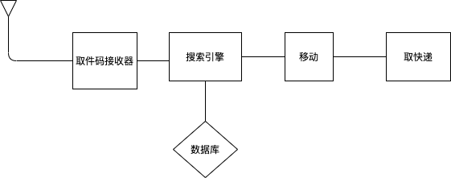
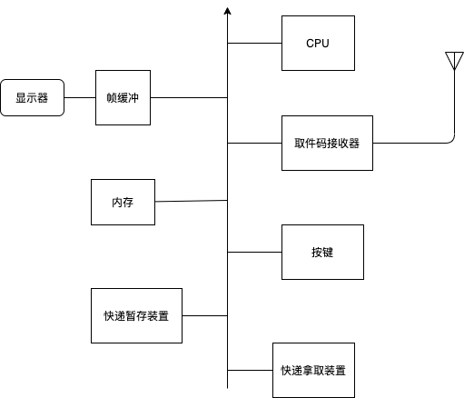
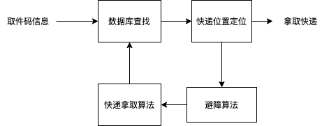

[TOC]

# 嵌入式产品设计初探

191250133 陶泽华

## 1.产品简介

### 1.1 名称

自动取快递机器

### 1.2 背景

1. 如今大量的快递往往不是直接派送到所填写的收货地址，而是送到附近的菜鸟驿站，这就导致了大量的快递汇聚在一起。
2. 虽然每一个快递都被编号，最初是按照顺序排放的，但随着取快递的人越来越多，快递原先排放好的顺序经常被打乱，让后来者很难找到，经常一找就要很久。
3. 更有些地方，人们无法自己去找自己的快递，而是需要通过告知工作人员取件码，由工作人员代为寻找。在取快递高峰期，通常取个快递需要等待半小时以上，给人们的生活带来了诸多不便。

### 1.3 功能

1. 记录每个快递在货架上的具体位置，帮助每个来取快递的顾客快速且准确的找到自己的快递。

## 2.总体体系结构

## 3.硬件体系结构

## 4.软件体系结构

