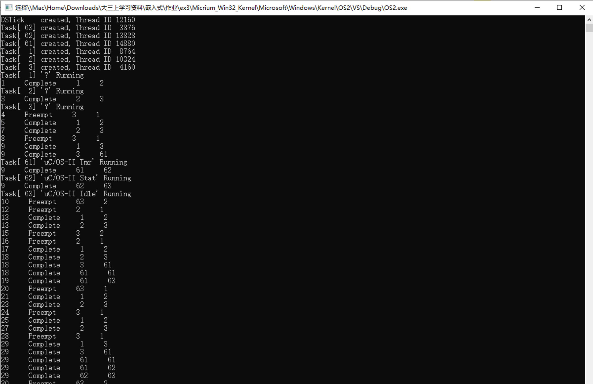
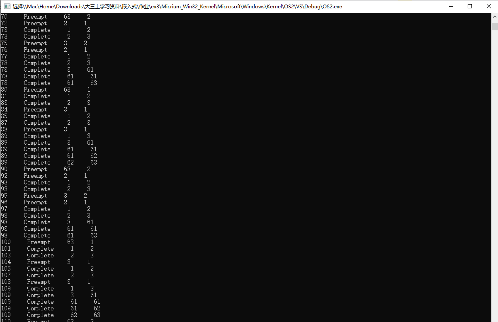
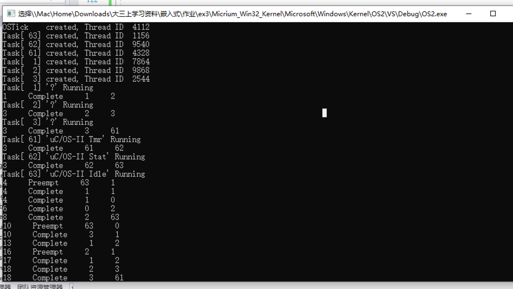
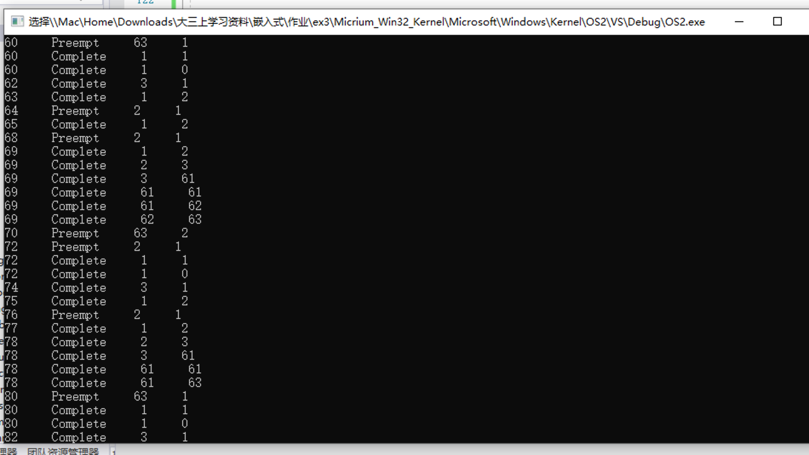

# 嵌入式实验——ucOS-II多任务 

191250133 陶泽华

[TOC]

## 1.实验目的

在ucOS-II上的多任务调度实验。

## 2.实验内容

在pc上的ucOS-II移植版本上实现三个周期性任务的调度。

## 3.任务之间没有相关性的实验过程

### 3.1 在struct OS_TCB中添加变量

```java
INT32U compTime;  // 完成任务还需要的时间
INT32U period;  // 周期
INT32U fullCompTime; // 总共需要的时间
```

### 3.2 在main.c中添加任务函数

```c++
static void periodicTask(void *p_arg);

static void periodicTask(void *p_arg) {

	INT32S ∗p = (INT32S *) p_arg;
	OSTCBCur->compTime = p[0];
	OSTCBCur->period = p[1];
	OSTCBCur->fullCompTime = p[0];

	INT32S start; 
	INT32S end; 
	INT32S toDelay;

	start = 0;

	OS_TRACE_INIT(); // Initialize the uC/OS−II Trace recorder while (DEF TRUE)
	{

		while (OSTCBCur->compTime > 0) 1

		{

			//Do nothing

		}

    // 获得计数器的当前值
		end = OSTimeGet();
    // 计算任务需要延迟的时间
		toDelay = OSTCBCur->period - (end - start);
		toDelay = toDelay < 0 ? 0 : toDelay;
    start += (OSTCBCur->period);

    // 更新完成任务需要的时间
		OSTCBCur->compTime = OSTCBCur->fullCompTime;

    // 将任务延迟一段时间
		OSTimeDly(toDelay); 

	}
}
```

### 3.3 调用任务 

在main.c中添加创建任务代码。

根据RMS静态优先级调度算法。任务的周期越短，优先级越高。因此要在代码里面手动将周期最短的设置为优先级最高的，即排在最前面。

需要屏蔽原有部分创建任务的代码。

```c++
static  OS_STK  TaskStk[3][APP_CFG_STARTUP_TASK_STK_SIZE];


INT32S limits[][2] = { //computation , wait time 
	{ 0, 0 },//Prio0
	{ 1, 4 },//Prio1 
	{ 2, 5 },//Prio2 
	{ 2, 10 }//Prio3

	};

// 创建任务
OSTaskCreate(periodicTask, (void*)limits[1], &TaskStk[0][APP_CFG_STARTUP_TASK_STK_SIZE - 1u], 1);
	OSTaskCreate(periodicTask, (void*)limits[2], &TaskStk[1][APP_CFG_STARTUP_TASK_STK_SIZE - 1u], 2);
	OSTaskCreate(periodicTask, (void*)limits[3], &TaskStk[2][APP_CFG_STARTUP_TASK_STK_SIZE - 1u], 3);
```

### 3.4 输入输出

 在os_core.c里面的OS_Sched()和OSIntExit()方法加入输出。

```c++
// OS Sched()
printf("%u", OSTime);
printf("     Complete     ");
printf("%d", OSPrioCur);
printf("     ");
printf("%d", OSTCBHighRdy->OSTCBPrio);
printf("\n");

// OSIntExit ()
// 
if (OSPrioCur != OSTCBHighRdy->OSTCBPrio) {
			printf("%u", OSTime);
			printf("     Preempt     ");
			printf("%d", OSPrioCur);
			printf("     ");
			printf("%d", OSTCBHighRdy->OSTCBPrio);
			printf("\n");
}
```

### 3.5 计数

 在os_core.c里面的OSTimeTick()方法加入computation的计数。

```c++
OSTCBCur−>compTime−−; // 在每个时钟节拍中减少任务完成还需要的时间
```

### 3.6 实验结果:

见下图。





## 4.任务之间有数据相关性的实验过程

### 4.1 在struct OS_TCB中添加变量

```java
INT32U compTime;  // 完成任务还需要的时间
INT32U period;  // 周期
INT32U fullCompTime; // 总共需要的时间
```

### 4.2 在main.c中添加任务函数

```c++
static void periodicTask2(void *p_arg);

static void periodicTask2(void *p_arg) {

	INT32S *p = (INT32S *)p_arg;
	OSTCBCur->compTime = p[0];
	OSTCBCur->period = p[1];
	OSTCBCur->fullCompTime = p[0];

	INT8U err;
	INT32S start;
	INT32S end;
	INT32S toDelay;

	start = 0;

	OS_TRACE_INIT(); // Initialize the uC/OS−II Trace recorder while (DEF TRUE)
	while (DEF_TRUE) {
		// 请求互斥信号量
		OSMutexPend(pevent, 0, &err);

		while (OSTCBCur->compTime > 0) {

			//Do nothing

		}

		end = OSTimeGet();
		toDelay = OSTCBCur->period - (end - start);
		toDelay = toDelay < 0 ? 0 : toDelay;
		start += (OSTCBCur->period);

		OSTCBCur->compTime = OSTCBCur->fullCompTime; // reset the computation

		OSTimeDly(toDelay); // delay and wait (fullCompTime − period) times }

		// 归还信号量
		OSMutexPost(pevent);
	}
}
```

### 4.3 调用任务 

1. 在main.c中添加创建任务代码。
2. 根据RMS静态优先级调度算法。任务的周期越短，优先级越高。因此要在代码里面手动将周期最短的设置为优先级最高的，即排在最前面。
3. 需要屏蔽原有部分创建任务的代码。
4. 使用互斥信号量

```c++
static  OS_STK  TaskStk[3][APP_CFG_STARTUP_TASK_STK_SIZE];
OS_EVENT* pevent;

INT32S limits[][2] = { //computation , wait time 
	{ 0, 0 },//Prio0
	{ 1, 4 },//Prio1 
	{ 2, 5 },//Prio2 
	{ 2, 10 }//Prio3

	};

INT8U error;
	// 创建互斥信号量
	pevent = OSMutexCreate(0,&error);
	OSTaskCreate(periodicTask2, (void*)limits[1], &TaskStk[0][APP_CFG_STARTUP_TASK_STK_SIZE - 1u], 1);
	OSTaskCreate(periodicTask, (void*)limits[2], &TaskStk[1][APP_CFG_STARTUP_TASK_STK_SIZE - 1u], 2);
	OSTaskCreate(periodicTask2, (void*)limits[3], &TaskStk[2][APP_CFG_STARTUP_TASK_STK_SIZE - 1u], 3);
```

### 4.4 输入输出

 在os_core.c里面的OS_Sched()和OSIntExit()方法加入输出。

```c++
// OS Sched()
printf("%u", OSTime);
printf("     Complete     ");
printf("%d", OSPrioCur);
printf("     ");
printf("%d", OSTCBHighRdy->OSTCBPrio);
printf("\n");

// OSIntExit ()
// 
if (OSPrioCur != OSTCBHighRdy->OSTCBPrio) {
			printf("%u", OSTime);
			printf("     Preempt     ");
			printf("%d", OSPrioCur);
			printf("     ");
			printf("%d", OSTCBHighRdy->OSTCBPrio);
			printf("\n");
}
```

### 4.5 计数

 在os_core.c里面的OSTimeTick()方法加入computation的计数。

```c++
OSTCBCur−>compTime−−; // 在每个时钟节拍中减少任务完成还需要的时间
```

### 4.6 实验结果

见下图。





