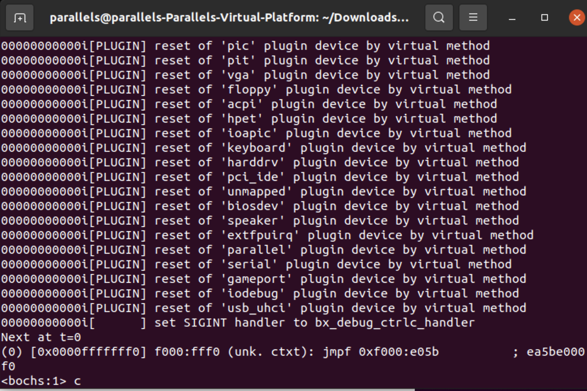
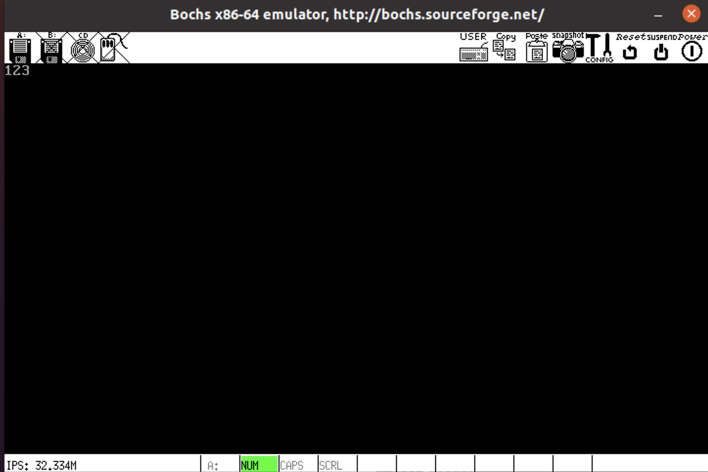
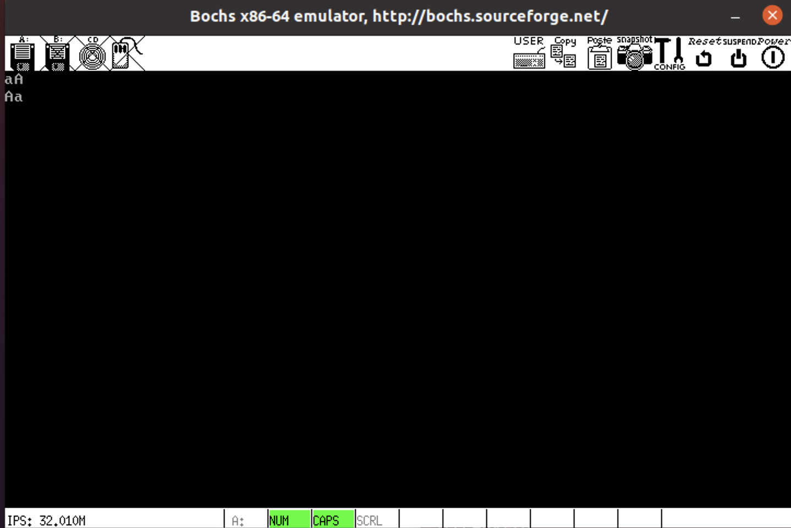
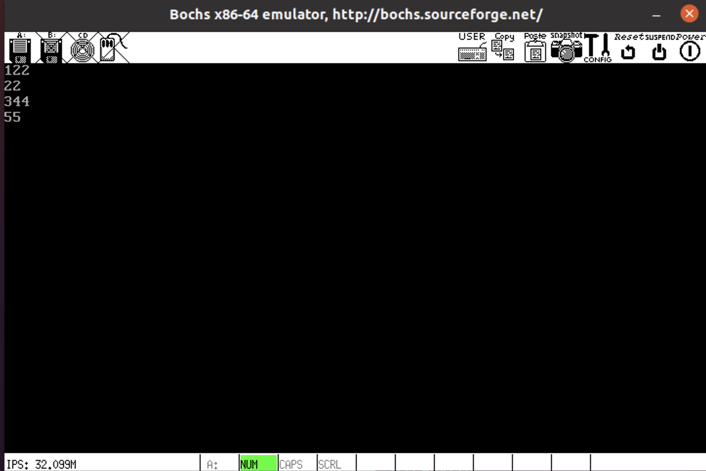
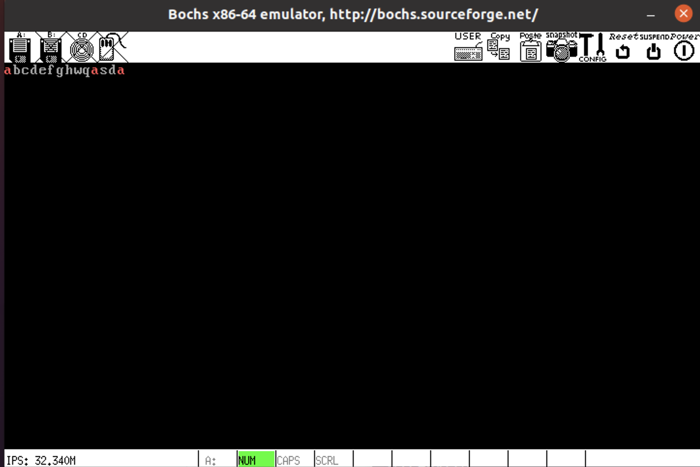

## 1. 实现的功能

1. 从屏幕左上角开始，以白色显示键盘输入的字符。可以输入并显示 a-z,A-Z 和 0-9 字符。
2. 大小写切换包括 Shift 组合键以及大写锁定两种方式。大写锁定后再用 Shift 组合键将会输入小写字母
3. 支持回车键换行。
4. 支持用退格键删除输入内容。
5. 支持空格键和 Tab 键(4 个空格，可以被统一的删除)
6. 每隔 20 秒左右, 清空屏幕。输入的字符重新从屏幕左上角开始显示。
7. 有光标显示，且光标闪烁，光标跟随输入字符的位置变化。 
8. 支持屏幕滚动翻页，输入字符数没有上限。
9. 查找功能
   - 按 Esc 键进入查找模式，在查找模式中不会清空屏幕。
   - 查找模式输入关键字，被输入的关键字以红色显示
   - 按回⻋后，所有匹配的文本 (区分大小写) 以红色显示，并屏蔽除 Esc 之外任何输入。
   - 再按 Esc 键，之前输入的关键字被自动删除，所有文本恢复白颜色, 光标回到正确位置。
10. 按下 control + z 组合键可以撤回操作(包含回车和 Tab 和删除)，直到初始状态。

## 2.代码执行流程

1. bochsrc的配置如下：

   ```bash
   ###############################################################
   # Configuration file for Bochs
   ###############################################################
   
   # how much memory the emulated machine will have
   megs: 32
   
   # filename of ROM images
   romimage: file=/usr/share/bochs/BIOS-bochs-latest
   vgaromimage: file=/usr/share/vgabios/vgabios.bin
   
   # what disk images will be used
   floppya: 1_44=a.img, status=inserted
   
   # choose the boot disk.
   boot: a
   
   # where do we send log messages?
   # log: bochsout.txt
   
   # disable the mouse
   mouse: enabled=0
   
   # enable key mapping, using US layout as default.
   keyboard: keymap=/usr/share/bochs/keymaps/x11-pc-us.map
   ```

2. Makefile的配置如下
   注意：由于电脑上的系统为64位，gcc后面需要加上-m32，LDFLAGS前需要加上-m elf_i386

   ```bash
   #########################
   # Makefile for Orange'S #
   #########################
   
   # Entry point of Orange'S
   # It must have the same value with 'KernelEntryPointPhyAddr' in load.inc!
   ENTRYPOINT	= 0x30400
   
   # Offset of entry point in kernel file
   # It depends on ENTRYPOINT
   ENTRYOFFSET	=   0x400
   
   # Programs, flags, etc.
   ASM		= nasm
   DASM		= ndisasm
   CC		= gcc -m32
   LD		= ld
   ASMBFLAGS	= -I boot/include/
   ASMKFLAGS	= -I include/ -f elf
   CFLAGS		= -I include/ -c -fno-builtin -fno-stack-protector
   LDFLAGS		= -m elf_i386 -s -Ttext $(ENTRYPOINT)
   DASMFLAGS	= -u -o $(ENTRYPOINT) -e $(ENTRYOFFSET)
   
   # This Program
   ORANGESBOOT	= boot/boot.bin boot/loader.bin
   ORANGESKERNEL	= kernel.bin
   OBJS		= kernel/kernel.o kernel/syscall.o kernel/start.o kernel/main.o\
   			kernel/clock.o kernel/keyboard.o kernel/tty.o kernel/console.o\
   			kernel/i8259.o kernel/global.o kernel/protect.o kernel/proc.o\
   			lib/kliba.o lib/klib.o lib/string.o
   DASMOUTPUT	= kernel.bin.asm
   
   # All Phony Targets
   .PHONY : everything final image clean realclean disasm all buildimg
   
   # Default starting position
   nop :
   	@echo "why not \`make image' huh? :)"
   
   everything : $(ORANGESBOOT) $(ORANGESKERNEL)
   
   all : realclean everything
   
   image : realclean everything clean buildimg
   
   clean :
   	rm -f $(OBJS)
   
   realclean :
   	rm -f $(OBJS) $(ORANGESBOOT) $(ORANGESKERNEL)
   
   disasm :
   	$(DASM) $(DASMFLAGS) $(ORANGESKERNEL) > $(DASMOUTPUT)
   
   # We assume that "a.img" exists in current folder
   buildimg :
   	dd if=boot/boot.bin of=a.img bs=512 count=1 conv=notrunc
   	sudo mount -o loop a.img /mnt/floppy/
   	sudo cp -fv boot/loader.bin /mnt/floppy/
   	sudo cp -fv kernel.bin /mnt/floppy
   	sudo umount /mnt/floppy
   
   boot/boot.bin : boot/boot.asm boot/include/load.inc boot/include/fat12hdr.inc
   	$(ASM) $(ASMBFLAGS) -o $@ $<
   
   boot/loader.bin : boot/loader.asm boot/include/load.inc boot/include/fat12hdr.inc boot/include/pm.inc
   	$(ASM) $(ASMBFLAGS) -o $@ $<
   
   $(ORANGESKERNEL) : $(OBJS)
   	$(LD) $(LDFLAGS) -o $(ORANGESKERNEL) $(OBJS)
   
   kernel/kernel.o : kernel/kernel.asm include/sconst.inc
   	$(ASM) $(ASMKFLAGS) -o $@ $<
   
   kernel/syscall.o : kernel/syscall.asm include/sconst.inc
   	$(ASM) $(ASMKFLAGS) -o $@ $<
   
   kernel/start.o: kernel/start.c include/type.h include/const.h include/protect.h include/string.h include/proc.h include/proto.h \
   			include/global.h
   	$(CC) $(CFLAGS) -o $@ $<
   
   kernel/main.o: kernel/main.c include/type.h include/const.h include/protect.h include/string.h include/proc.h include/proto.h \
   			include/global.h
   	$(CC) $(CFLAGS) -o $@ $<
   
   kernel/clock.o: kernel/clock.c
   	$(CC) $(CFLAGS) -o $@ $<
   
   kernel/keyboard.o: kernel/keyboard.c
   	$(CC) $(CFLAGS) -o $@ $<
   
   kernel/tty.o: kernel/tty.c
   	$(CC) $(CFLAGS) -o $@ $<
   
   kernel/console.o: kernel/console.c
   	$(CC) $(CFLAGS) -o $@ $<
   
   kernel/i8259.o: kernel/i8259.c include/type.h include/const.h include/protect.h include/proto.h
   	$(CC) $(CFLAGS) -o $@ $<
   
   kernel/global.o: kernel/global.c include/type.h include/const.h include/protect.h include/proc.h \
   			include/global.h include/proto.h
   	$(CC) $(CFLAGS) -o $@ $<
   
   kernel/protect.o: kernel/protect.c include/type.h include/const.h include/protect.h include/proc.h include/proto.h \
   			include/global.h
   	$(CC) $(CFLAGS) -o $@ $<
   
   kernel/proc.o: kernel/proc.c
   	$(CC) $(CFLAGS) -o $@ $<
   
   lib/klib.o: lib/klib.c include/type.h include/const.h include/protect.h include/string.h include/proc.h include/proto.h \
   			include/global.h
   	$(CC) $(CFLAGS) -o $@ $<
   
   lib/kliba.o : lib/kliba.asm
   	$(ASM) $(ASMKFLAGS) -o $@ $<
   
   lib/string.o : lib/string.asm
   	$(ASM) $(ASMKFLAGS) -o $@ $<
   
   run: image
   	bochs
   ```
   
3. 进入项目目录后，输入make run运行程序，在命令行输入**c**，程序即可运行。

   

3. 若出现/mnt/floppy不存在，使用`sudo mkdir /mnt/floppy`命令创建目录即可

## 3.运行截图









